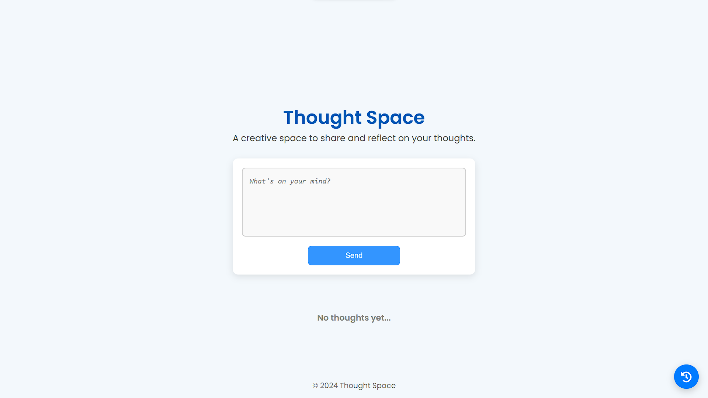

# Thought Space

Thought Space is a web application designed to let users freely express and share their thoughts. Inspired by a virtual "thought cloud," the app provides a calming and creative space for users to submit, view, and reflect on their thoughts.

## Features

- **Thought Space:** Displays user-submitted thoughts in a random, free-flowing layout.
- **Thought Input:** A simple interface for users to submit their thoughts.
- **Daily Collection:** View your thoughts organized by day for reflection and inspiration.
- **Responsive Design:** Fully optimized for both desktop and mobile screens.
- **Calming UI:** A soothing color palette to create a relaxing experience.

## Tech Stack

- **Frontend:** React.js
- **Backend:** Express.js
- **Database:** MongoDB
- **Styling:** CSS with animations
- **Deployment:** Vercel (Frontend) and Render/Heroku (Backend)

## Installation

1. Clone the repository:
   ```bash
   git clone https://github.com/your-username/thought-space.git
   ```

2. Navigate to the project directory:
   ```bash
   cd thought-space
   ```

3. Install dependencies:
   - Frontend:
     ```bash
     cd frontend
     npm install
     ```
   - Backend:
     ```bash
     cd ../backend
     npm install
     ```

4. Set up environment variables:
   - Create a `.env` file in the `backend` directory with the following:
     ```env
     MONGO_URI=your_mongodb_connection_string
     PORT=5000
     ```

5. Start the development servers:
   - Backend:
     ```bash
     npm start
     ```
   - Frontend:
     ```bash
     cd ../frontend
     npm start
     ```

6. Open the app in your browser at `http://localhost:3000`.

## Usage

1. Open the app and log in or continue as a guest.
2. Submit your thoughts using the input field at the bottom.
3. View your thoughts scattered in the main thought space.
4. Access the "Daily Collection" to see your past thoughts.

## Contribution

We welcome contributions to improve Thought Space! To contribute:

1. Fork the repository.
2. Create a new branch for your feature or bugfix.
3. Submit a pull request with a detailed description of your changes.

## Files

The files required for deployment and setup will be uploaded shortly.

---

### Stay Inspired
Thought Space is designed to foster creativity, mindfulness, and connection. Share your thoughts and explore the power of collective inspiration!
